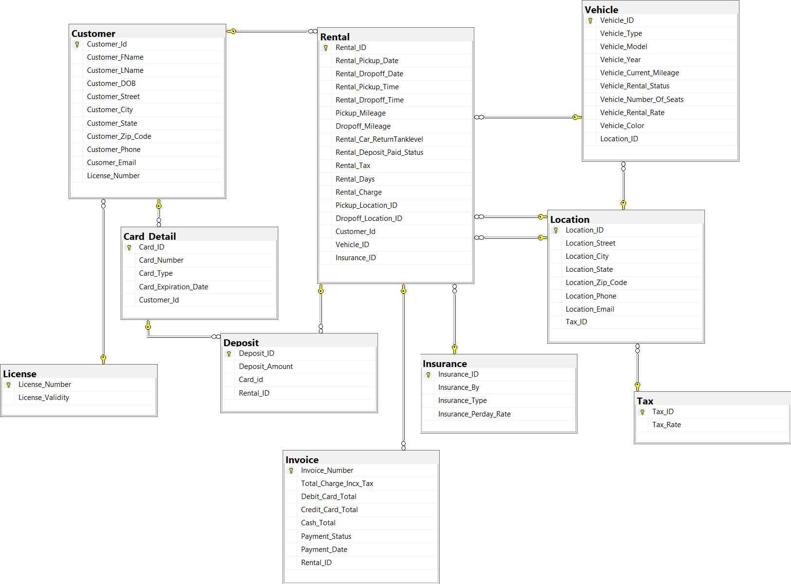

# Vehicle-Rental-Database
 Group project in which we created a vehicle rental database using SQL and SQL Server Management Studio. The project also includes a word document with normalization and SQL queries for the database, an ERD as well as DDL and DML for both the SQL and MySQL versions of the database. We also a created a simple web application build using PHP and MySQL. The application has three web pages showing Customer details, Vehicle details and total revenues collected respectively.

